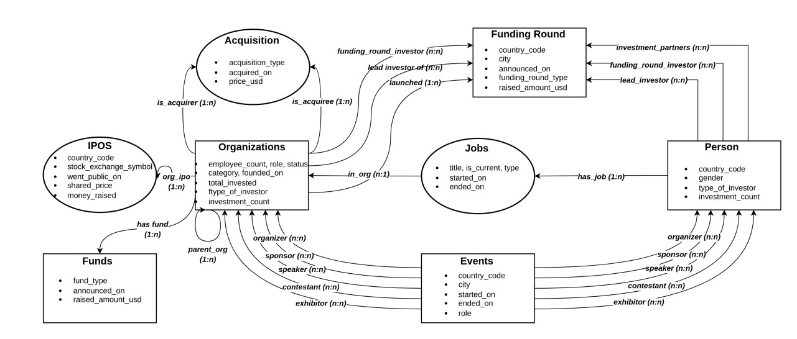

# FinQA: New Challenges in Question Answering over Knowledge Graphs


FinQA is a new dataset for question-answering on knowledge graphs (KGQA). The dataset was created to reflect the challenges we identified in real-world applications which are not covered by existing benchmarks, namely, multi-hop constraints, numeric and literal embeddings, ranking, reification, and hyper-relations. 

The repository contains scripts for:
- creating a Knowledge Graph from the Crunchbase database;
- creating a Question Answering dataset based on multiple-hop templates and paraphrasing;
- running experiments with state-of-the-art KGQA models on FinQA. 

**⚠️ IMPORTANT: Since the Crunchbase dataset is subject to licensing, the repository contains a script to process a dump and reconstruct KG. The dump provided by Cruchbase under the academic license contains all records till the current timestamp. To match the KG we used to generate questions, the script *construct_kg.py* processes data records until the given timestamp (December 2021 to match our KG)**.

*FinQA can be downloaded from [link]().*

### Quick start
```sh
# retrieve and install project in development mode
git clone https://github.com/colab-nyuad/FinQA

# set environment variables
source set_env.sh
```

## Table of contents
1. [Data](#data)
2. [KG constraction](#kg)
    1. [KG construction from CSV](#kg_csv)
    2. [KG construction from RDF](#kg_rdf)
3. [QA templates](#qa_templates)
4. [QA dataset](#qa_dataset)
5. [Training KGQA model](#kgqa_model)
    1. [Training Embeddings](#embeddings)
    2. [Running KGQA](#kgqa)

## Data <a name="data"></a>
Download Crunchbase dump and unzip into the folder data

## Creating KG from crunchabse data  <a name="kg"></a>

The Crunchbase data dump comprises 17 relational tables with primary and foreign keys to link tables together. To build the KG, we use a simple approach. We create new entities for each main entity type and use reification nodes to map the relationship between the base entity types and link additional information like start date, end date, title, etc. For the job titles we limit the range to a set of categories that can be found in *jobs.json*.

**KG construction from CSV**  <a name="kg_csv"></a>

The knowledge graph generated from the csv dump includes 3.2 million entities, 31 relations, and 17.6 million triples. Following is the structure of the created KG:



The command to generate KG:
```python
python construct_kg.py
```

**KG construction from RDF** <a name="kg_rdf"></a>

In the paper [*A Linked Data Wrapper for CrunchBase*](http://dbis.informatik.uni-freiburg.de/content/team/faerber/papers/CrunchBaseWrapper_SWJ2017.pdf), authors proposed a wraper around the CruchBase API that provides data in RDF format. The paper includes a link to the dump dated October, 2015. Since this dump is publicly available, we map the RDF data to the KG tirples fromat and provide a link for download. The mapped KG is smaller than the used KG for constracting the questions. This version is missing events and a set of atrributes for other entities but contains the product entities. This smaller version of KG and the scheme of it can be downloaded from [link](). 

## QA templates <a name="qa_templates"></a>

The templates are classified into 3 categories: 
* 1-hop (inferential chain of the length 1 and at most 1 constraint)
* 2-hop (inferential chain of the length 2 and at most 1 constraint) 
* advanced - the rest  

Following is an example of the advanced question template:
```json
   {
    "main_chain": "org1-in_org-job1-has_job-person",
    "question": [
       "[org1] alumni who founded more than 5 companies",
       "founders of more than 5 companies who previously worked in [org1]",
       "list people who formerly worked in [org1] and founded more than 5 companies"
    ],
    "constraints": [
      {
       "entity_constraint": {
        "job1-is_current-job_current": ["False"]
       }
      },
      {
        "entity_constraint": {
          "person-has_job-job2-job_title-job_title": ["founder", "co-founder"]
         }
      },
      {
        "numeric_constraint": {
         "job2-in_org-org2": {
          "count_over":"org2",
          "group_by": ["person"],
          "numeric": ["", ">", 5]
         }
        }
       }
     ]
   }
```

Each template contains:
* main_chain - a path in the KG leading form the head entity to the answers in the format (entity<sub>1</sub>-relation<sub>1</sub>-entity<sub>2</sub>-relation<sub>2</sub>-.... relation<sub>n</sub>-entity<sub>n+1</sub>). 
* question - a language form of the question where '[]' indicates the head entity and '()' indicate contraints entitites to be replaced when questions are generated according to the template
* constraints (*entity constraint*, *temporal constraint*, *maximum constraint*, *numeric constraint*)

\textbf{\emph{Entity constraint}} requires a specific entity to be equal to a certain value, e.g., for queries asking about female founders in Abu Dhaib it can be specified as gender = 'female', city = 'Abu Dhabi' and job\_title='founder'. \textbf{\emph{Temporal constraint}} requires the date to be within a specified time range. A sufficient set of questions that we surfed require a time range, and not necessary an implicit timestamp. Some of the questions are aimed to see the dynamic attached to a specific period (e.g., pandemic), which can be reflected through a temporal constraint. For example, from the beginning of COVID-19 can specified as "after 2019" in the template. \textbf{\emph{Maximum constraint}} is introduced to reflect key words as "top", "at most", "the highest" and etc. Maximum is always computed within a group, e.g., if we want to know "which Software companies have the highest ipo share price", the constraint first specifies grouping by the category
Software and then selects the maximum among share prices. Another setting the maximum constraint supports is first counting over edges and then selecting maximum, e.g., "companies acquired by Meta mostly come from which industry". In this example, the number of companies that Meta acquired in each industry is counted and the industry with the highest count is selected. \textbf{\emph{Numeric constraint}} reflect the key words "more than", "less than", "at least". This constraint implies counting over edges, e.g., for a question "list companies with acquired more than 50 companies", the constraint first specifies grouping by organization acquisitions where it is an acquirer, then counts acquirees and selects a company based on a condition for a number of acquirees $> 50$. 


## Constraints

### simple_constraint_nominal_1hop

1-hop constraint, tail entity must be equal to some value

Format: 

entity1-relation-entity2 [value0, value1, value2]

where entity2 needs to be equal to one of the values

### temporal_constraint

1-hop constraint, tail entity is a date, must be in a certain range

Format: 

entity1-relation-entity2 [before yyyy/mm]

entity1-relation-entity2 [after yyyy/mm]

entity1-relation-entity2 [between yyyy/mm, yyyy/mm]

### simple_constraint_nominal_2hop

1-hop constraint, tail entity must be equal to some value

Format:

entity1-relation1-entity2-relation2-entity3 [value0, value1, value2] 

where entity3 needs to be equal to one of the values

### numeric_constraint

Constraint for range selection.

Example:

"group_by" :[column1, column2] (by default group by the head entity)

"numeric": ["column", ">", 2]

### max_constraint

1-hop, tail entity is the value that should be a gwoup-wise maximum

"group_by": [column1, column2] (by default group by the head entity)

"max": "column"

### Date selection

## Ro do: can create a variable specifying the granularity (year or month)


\textbf{\emph{Multi-entity/relation}} type is introduced to cover questions which can refer to multiple entities or relations, e.g., if we ask about investors, both companies and people can make investments, or if a question is about participating in an event without specifying a specific role, we should encounter all types of relations, i.e., sponsor, speaker, organizer, contestant and exhibitor. 


|   | 1-hop  | 2-hop  | advanced  | total |
| :---        |    :----:  |    :----:  |    :----:  |    :----:  |
|0     |0    |0   |0   |0    |

## QA dataset <a name="qa_dataset"></a>


Command to generate QA datset: python genrate_dataset.py

Command to shuffle and split generated questions into train, valid, test: ./qa_dataset/split_train_valid_test.bh

## Training the model and running experiments <a name="kgqa_model"></a>

```sh
usage: main.py [-h] [--dataset DATASET] [--kg_type KG_TYPE]
              [--model {TransE,RESCAL,CP,Distmult,SimplE,RotH,RefH,AttH,ComplEx,RotatE}]
              [--hops HOPS] [--regularizer {L3}] 
              [--reg REG] [--optimizer {Adagrad,Adam}]
              [--max_epochs MAX_EPOCHS] [--valid_every VALID]
              [--dim RANK] [--patience PATIENCE]
              [--batch_size BATCH_SIZE]
              [--learning_rate LEARNING_RATE]
              [--freeze FREEZE] [--use_cuda USE_CUDA]
              [--num_workers NUM_WORKERS]
              [--qa_nn_type {LSTM,RoBERTa}] ---gpu GPU]
              [--use_relation_matching USE_RELATION_MATCHING]
              [--labels_smoothing LABELS_SMOOTHING]
 
Knowledge Graph QA

arguments:
  -h, --help            show this help message and exit
  --dataset             Knowledge Graph dataset
  --kg_type             Type of graph (full, sparse)
  --model {TransE,RESCAL,CP,Distmult,SimplE,RotH,RefH,AttH,ComplEx,RotatE}
                        Knowledge Graph embedding model and QA score function
  --regularizer {L3}
                        Regularizer
  --reg                 Regularization weight
  --optimizer {Adagrad,Adam}
                        Optimizer
  --max_epochs
                        Maximum number of epochs
  --patience            Number of epochs before early stopping for KG embeddings
  --valid_every         Number of epochs before validation for QA task
  --dim                 Embedding dimension
  --batch_size          Batch size for QA task 
  --learning_rate       Learning rate for QA task
  --hops                Number of edges to reason over to reach the answer 
  --freeze              Freeze weights of trained KG embeddings
  --use_cuda            Use gpu
  --gpu                 How many gpus to use
  --num_workers         Number of workers for parallel computing 
  --labels_smoothing    Labels smoothing
  --qa_nn_type {LSTM,RoBERTa}
                        Which NN to use for question embeddings
  --use_relation_matching 
                        Use relation matching for postprocessing candidates in QA task
```

### Avilable models
This implementation includes the following models:
- [ComplEx](http://proceedings.mlr.press/v48/trouillon16.pdf)
- [TransE](https://papers.nips.cc/paper/2013/file/1cecc7a77928ca8133fa24680a88d2f9-Paper.pdf)
- [DistMult](https://www.microsoft.com/en-us/research/wp-content/uploads/2016/02/ICLR2015_updated.pdf)


Command to shuffle and split generated triples into train, valid, test: ./kg/split_train_valid_test.bh

Command to train kg embeddings using pykeen:
python train_embeddings.py --model DistMult --train_path kg/clustering/train.txt --valid_path kg/vanilla/valid.txt --test_path kg/vanilla/test.txt --dim 200 --results_folder embeddings/clustering_distmult --gpu 1

Command to run KGQA framework: 
python run.py --model DistMult --embeddings_folder embeddings/clustering_distmult --freeze True
